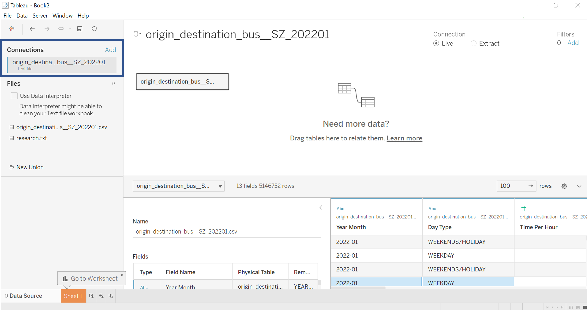
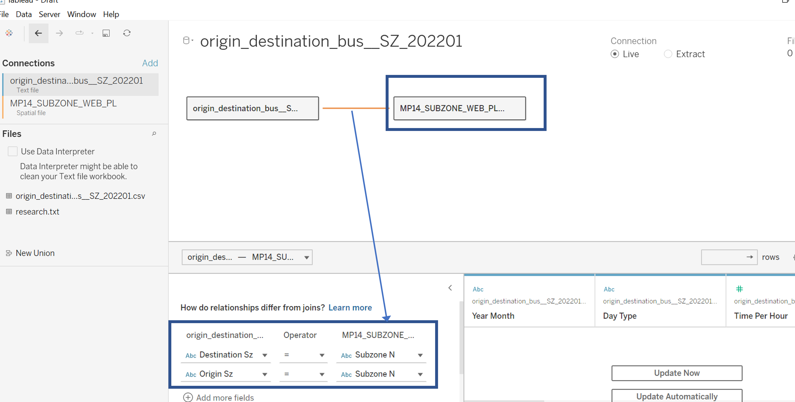

```{r setup, include=FALSE}
knitr::opts_chunk$set(echo = FALSE)
```

```{r}
packages = c('rmarkdown')
for(p in packages){
  if(!require(p,character.only = T)){
    install.packages(p)
  }
  library(p,character.only = T)
}
```
#   1. Original Visualisation 

The [original visualisation](https://public.tableau.com/app/profile/tskam/viz/prototype1_16468762782120/Dashboard1) was created using the following data:

* origin_destination_bus_SZ_202201.csv.  This data set was downloaded from LTA Datamall and URA region, planning area and planning subzone information were added by using GIS Overlay operation.

* MP14_SUBZONE_WEB_PL. This data provides URA Master Plan 2014 Planning Subzone boundary map in ESRI shapefile format. It was downloaded from data.gov.sg.


There are some issues on the clarity, aesthetics and interactive design of the original data visualization as explained in the subsequent section.  

##  1.1 Clarity 

**a. Absence of visualisation titles, lead-in, source** 

There is no title nor lead-in to explain the context of the visualisation. Users would not know the key message(s) that the visualisation is trying to convey. There is also no indication of the time period and the data source. While a reader familiar with Singapore might be able to interpret that the visualisation is mean to show trips made between different local sub-zones, it is unclear what type of trips are shown e.g. could it be trips via MRT, or trips made by private vehicles? A simple title like "Singapore's Public Buses inter- and intra-zonal trips made in January 2022" could provide better clarity.

**b. Barcharts - Improper labelling of x-axis and y-axis ** 

For the bar charts, it is not clear that they are meant to measure the number of trips taken during certain time period due to the improper use of axis labels. Although the the x-axis is titled 'Time Per Hour" it is not clear that it meant the 24hour time format especially since the tick marks are denoted by numbers. For the y-axis, it could have been labelled as "No. of trips", instead of "Weekends" or "Weekdays". 

**c. Adjacency Matrix - Unclear axis labels and intent**

For the adjacency matrix, it is unclear what is the intent and what insights can be drawn as it appears to be a square with dots on first look. Users could not see the x-axis and y-axis labels of the "Origin Sz" and "Destination Sz" at all. Even if I zoom out, the over-lapping labels make it impossible to read and interpret what each point in the matrix represents without hovering to trigger the tooltip.  For the tooltip, the description is not easy to interpret for a user not familiar with tableau i.e. what is meant by "Total Trips along Table(Across)". While there is a legend at the corner, it is unclear what is meant by "Total Total Trips". 


**d. Unable to visualise number of inter/intra-zonal trips**

It is difficult for users to determine the number of trips taken from one location to the other (intra- or inter-zonal) from the dashboard e.g. the number of trips that originate from Ang Mo Kio town center and destined to Anak Bukit. The bar charts only showed the number of trips generated from one sub-zone (e.g. total number of trips from Ang Mo Kio) or to one sub-zone (e.g. total number of trips that ends at Anak Bukit), whereas the adjacency matrix only showed the proportion. 

##  1.2 Aesthetics

**a. Poor choice of colours for the legend** 

Looking at the adjacency matrix and comparing it with the legend, it is hard to see if there is any differentiation for the different points at all. It is hard to interpret the legend that is supposed to show the "% of Total Total Trips" due to the poor choice of colour. 

**b. View of adjacency matrix is not optimal**

The adjacency matrix tried to show all the origin and destination subzones within a small space, hence the labels are either cut out or overlapped with each other, which makes it impossible to interpret the location. The matrix could either use the tableau options "Fit width' or "Fit height" instead of "Fit entire view" to allow users the option to scroll through the matrix to view each location. Alternatively, it could just show the top X (e.g. 20 locations by origin at one go, so that reader can know which location each point is referring to. 

In addition, the size of each point in the matrix is too small for users to compare the proportion of trips. The size of the points could be adjusted to a larger value using the 'size' option in the 'Marks' component so that we can see that the differentiation in colours for different proportions  (see demo below). 

{width=60%}

**c. Poor layout, lack of data ink and annotations**

The 4 bar charts used the same colour without data inking or annotations, which makes it hard for users to identify the purpose of each chart, especially when some of the the sub-zones showed similar patterns across the different days. For the weekend charts, there is a lot of blank space as well. The proportion of space used for the bar charts and the adjacency matrix could be better managed.

To improve, the 2 bar charts for trips  from a sub zone could have been combined into one chart, with different colours for different days, or to be shown only when users make the selection (either hover or upon select). Besides a more optimal use of space, this will also enable users to compare the the results for different days easily. 


##  1.3 Interactivity of Design

**a. Poor usability of filters ** 

The filters contained a long list of sub-zones, which is tedious for users to scroll through if they want to find a specific sub-zone. There is also no need for "Null" to be shown as a filter value since it does not serve any purpose. It would be more useful for the filters to have a search function for quicker result.

Also, the filters does not have any interactivity with the adjacency matrix even though it is placed right next to the matrix. 

**b. Format of tooltip can be improved ** 

The tooltip for the adjacency matrix only showed the row proportion of trips made from each origin to all destinations (and the label is not clear as mentioned in 1.1c), and not the column proportion e.g.X% of trips destined for Ang Mok Kio originated from Aljunied. It would also be more useful to show the number of trips for the intra and inter-zonal flows. 

The tooltips for the bar chart also did not provide the proportion of trips made during the selected time period.

**c. Lack of interaction between adjacency matrix and the bar charts** 

Given that the bar charts and adjacency matrix appeared in the same dashboard, there should be interactivity between the two types of visualizations. For instance, if a user click a cell in the adjacency matrix, the bar charts could  be triggered to show the trips made between the selected sub-zones.

#   2. Proposed Design

##  2.1 Sketch of the Proposed Design

The improved design  aim to allow users (such as transport planners) to obtain insights of the intra and inter-zonal flows clearly and quickly to achieve the following objectives: 

* to find out where are the sub-zones with the highest number of trips originating from (generated by) and destined to (attracted to), This will be useful to forecast infrastructure needs such as  more/bigger bus stops and/or interchanges for regions with high trips.
* to find out where are the busiest routes at the planning area and sub-zone level, which can help to determine the potential reasons for travel e.g. for work or leisure. This will be useful for making decisions on which route to deploy more buses/bus stops.
* for the busiest routes, which are the days (weekdays or weekends/holidays) and timings that have higher or lower frequencies, so that they can better plan the frequencies of the buses and deploy more buses during peak periods.

Hence, the proposed design of the makeover dashboard is structured into the following:

**a. Overview of volume of bus trips by Planning Area (PA) ** 

{width=60%}

**b. Origin/Destination Flow at Planning Area level ** 

{width=60%}

**c. Origin/Destination Flow at Sub-Zone level**

For the third dashboard, the design is the same as the above OD matrix except that it shows the flow at sub-zone level, and will allow users to filter by the originating PA and destination PA. 

##  2.2 Advantages of the Proposed Design

### 2.2.1 Clarity

**a. Appropriate choice of charts**

+ The proposed visualisation added a choropleth map in the overview to allow users to know the distribution of trips, and understand that the data presented are based on planning area/sub-zones.  

+ The use of a bar chart in the overview, sorted by number of trips, allow users to immediately know which are the busiest location. 

+ The use of adjacency matrix to illustrate the intra- and inter-zonal flows are still useful, and hence retained in the proposed design. However, as there are many planning areas and sub-zones, the adjacency matrix are spitted into two dashboard, one at the planning area, and one at the sub-zone level. This will allow users to easily visualise the intensity of the bus trips at different zonal level, and yet do not lose the intent and meaningful aspects of the original visualization.

+ The adjacency matrix are also sorted based on number of trips, so that users can immediately zoom into the busiest zones.

+ For each adjacency matrix, upon hover, the user will be able to see the distribution of intra-, inter-zonal trips by timing and days. This is not provided for in the original visualisation, but will greatly help to determine the travel pattern on each bus route. 

**b. Meaningful Titles, source, instructions annotations**

+ The main title will be "Discovering Singapore Public Bus Activities and Travel Pattern in Jan 2022", and include the source at top of the dashboard, which will allow readers to immediately understand the context of the visualisation. The data source is also indicated a the top of the dashboard, besides improving clarity, it also provide credibility to the dashboards.

+ Each chart will come with their own sub-title and commentary as an annotation, to provide further clarity on the context, and the key observation of the respective dashboard.

+ As the dashboard are interactive, explanatory notes are added where necessary to guide users how to use the dashboard optimally.

**c. Labelling of x-axis and y-axis where necessary **

+ Appropriate axis labels are used where necessary e.g. "No of trips.

+ Unnecessary axis labels are removed if there are already appropriate legends, or explanatory notes to explain the charts e.g. removal of "Origin SZ", "Destination SZ"

### 2.2.2 Aesthetics

**a. Choice of colour palette**

+ The use of a single colour scheme to denote "Origin" locations and another colour scheme to denote "Destination" locations (both in the charts as well as title as shown in the "Overview" dashboard) makes the visualisation neater, and eliminated the need for titles/labels that could clutter the visualisation.

+ Different intensity of the same colour scheme is used for the cloropeth maps and adjacency matrix, to make it visually appealing and yet do not lose the ability to identify patterns.

**b. Optimal size of the charts for viewing**

+ As there are many planning areas and sub-zones, an optimal size is chosen so that users will be able to view the entire adjacency matrix clearly, without the need to scroll up and down. 

+ For the adjacency matrix, appropriate size of the cell with some gap between cells is chosen so that users can still identify the different cells, and visualise the intensity. 

**c. Use of legends**

+ The number of trips for the different planning areas differ significantly and there are numberous PAs to be shown in a single matrix. Hence the number of trips are grouped into 7 categories for the OD matrix at planning area, so that it is easier to visualise the differing intensity. 

+ Legends are placed next to the diagram so that is easy for users to refer to.

### 2.2.3 Interactive Design

**a. Use of tooltips**

+ The proposed design make use of tool tips for users to drill down to the distribution of trips by timing, and also information on the travel pattern from one destination another. This also helps to make better use of the dashboard layout.

+ For the tool tip at the OD matrices, 

**b. Use of filters**

+ Filters are included to allow users to filter to the day type (weekday or weekend/holidays), and the planning area (for OD matrix at sub-zone level).

+ For the PA filters, a drop down list is used which also enable users to search by typing the search text, makes it quicker to zoom to the required zone, and do not overclutter the dashboard.

+ Null values are also removed since they do not serve any purpose. 

**c. Use of actions**

+ Actions are added to allow users to visualise the selected PA (using the bar chart) on the choropleth maps, and vice versa (select a PA from map and highlight the corresponding trips.)

**d. Use of story style dashboard**

+ The use of story function in Tableau allow users to navigate the different dashboards easily and systematically, from overview to drilling down dashboards, providing ease for users to comprehend the story behind the dashboards.

##  2.3 The Proposed Visualisation

The proposed visualisation can be viewed on Tableau Public [here.](https://public.tableau.com/app/profile/bi.lian/viz/DataViz2_16483865919080/Story1?publish=yes)

**a. Overview of volume of bus trips by Planning Area (PA) ** 

First, user will find out the most congested PAs by trips and where they are located.


**b. Origin/Destination Flow at Planning Area level ** 

Then user can see the travel patterns between the PAs, and understand the timing differences.

{width=80%}

**c. Origin/Destination Flow at Sub-Zone level** 

Lastly, using the information found from a and b, user can select the congested areas for more in depth understanding on the flow at sub-zone level.

{width=80%}

#   3. Key Observations

a.  **Demand of buses highest at mature estates:** As shown in the dashboard (extracted below), the most number of trips were generated from and attracted to the mature estates like Jurong West, Bedok and Tampines, and there is no difference in the ranking positions over weekend/holidays or weekdays. Transport planner could look into possible reasons such as profile of residents staying at these locations (e.g. could it be that there are more older generation staying at these locations, and this is the group that takes buses more frequency). In addition, the high demand of buses at these locations indicate the need to ensure there are sufficient interchanges, the size of bus stops/interchanges are optimal to accomodate. 

{width=80%}

b.  **Commuters tend to travel on buses within the same planning area:** Based on the OD matrix at planning level, it is clear that intra-zonal trips were the highest, compared to inter-zonal. This indicate that travellers tend to use buses for shorter journeys within the same planning area. 

{width=80%}

c.  **Weekday peak timings differ from weekends/holidays, but congested locations do not vary too much:** Generally speaking, the weekday peak timings and weekend peak timings differ for most locations, which is obvious since most people have to travel to work on weekdays. This is so for the case of the trips from Jurong West PA to Jurong West PA (most congested route with more than 6 million trips on weekdays) as well as shown in the diagram below. However, interestingly, while the timings differ, the distribution of trips especially to the more congested sub-zones do not differ be it if it is weekday or weekend. This is useful for transport planners to focus on prioritising resources (e.g. more buses/drivers) for these congested areas. 


#   4. Challenges and future work

+ While the improved visualisation allow users to see the inter- and intra-zonal flows at different days and timings, and visualise the congested zones on the choropleth maps, the use of adjacency matrix restrict the design of the dashboard as it requires a substantial space in order to visualise properly. It is also hard to visualise the proportion of trips generated from or attracted to a specific zone and the inter- and intra-zonal flows at the same time within the same dashboard, without navigating across two charts or customising the tooltips.

+ Hence, alternative network diagram is explored for curiosity sake, which is the sankey diagram. The sankey diagram, with the addition of suitable labels or tool tips,  allows users to also view the proportion of trips generated from a location (or attracted to a location), and visually identify which are the locations that have routes, and the intensity of the flow. A sankey diagram using the same data is also included in the tableau dashboard as an alternative, and as shown below for reference.


+ For any future studies on the network flow, further customisation on sankey diagram could be explored, such as use of different colour themes to optimise the viewing of the data using sankey diagram, together with the use of Tableau actions, tool tips, calculated fields etc to improve the interactive dashboard. 

+ Separately, realise there is an issue with using "Action" on Story board in Tableau. In the original dashboard design, the dashboard of OD matrix at planning area level is designed to drill down to the OD matrix at the corresponding sub-zones of the planning area upon clicking a cell. However, when using the story board, this action cannot be triggered. 

#   5. Step-by-Step Description

This section details the steps required to produce the makeover dashboard as described in section 2.

## 5.1 Cleaning the data

No. | Step                 |   Screenshot
--- | ------------------   | ---------------------------
1.  | Load the origin_destination_bus_SZ_202201.csv file into Tableau Desktop. |{width=400px}  
2.  | Load the MP14_SUBZONE_WEB_PL.shp file in Tableau Desktop (for mapping purpose) and drag it next to the csv file. |{width=400px} 
3.  | Click on the red dotted line between the two files and select the relationships to join both files i.e. Origin_SZ = Subzone N;  Destination_SZ = Subzone N|{width=400px} 
4.  | From the original visualisation, we know that the data contains Null value. To filter away the Null values, click 'Filters' on the top right end corner, click "Add", and select "Origin Sz". Click ok. |{width=400px} 
5.  | Uncheck "Null". Click ok. |{width=50%}
6.  | Repeat steps 4 and 5 but select "Destination Sz" instead.Click Ok. |{width=50%} 
7.  | Check the "Filters" at the top right hand corner. There should now be 2 filters to remove the Null values.|{width=400px}  

## 5.2 Create Overview of trips by Planning Area

No. | Step                 |   Screenshot
--- | ------------------   | ---------------------------
1.  | Create a new Sheet 1. Double click on 'Geometry' at the Tables column, under the "MP14...shp" file. You should see a Singapore map created on the main panel, and the 'Longitude' and 'Latitude'  on the Columns and Rows section|{width=400px}  
2.  | Drag 'Origin PA' to 'Detail' under Marks, drag 'Total Trips' to 'Color'|{width=400px}   
3.  | Drag another 'Total Trips' to 'Detail'. Right click the newly dragged 'Total Trips', select 'Quick Table Calculation' followed by 'Percent of Total'. This is to obtain the proportion of trips for inclusion into the tooltip|{width=400px}
4.  | Click on 'Tooltip' and amend the description to the one as shown in the screenshot (note if we do not amend, the default description for the proportion is "% of Total Total Trips along Table (Across):", which is not easy to comprehend).|{width=400px}
5.  | Double click on the sheet title 'Sheet 1' to amend the title to "Volume of Bus Trips generated from Originating PA". Change the colour of "Originating PA" to blue for easier differentiation later on. |{width=400px}
6.  | Rename 'Sheet 1' to 'OriginPAMap'. Right click on the sheet name and click 'Duplicate Sheet'.|{width=50%}
7.  | Rename the duplicated sheet to 'DestinationPAMap'. Replace 'Origin Sz' with 'Destination Sz' by dragging the relevant fields to the Marks card.|{width=400px}  
8.  |  Follow step 5 to change title i.e. double click on the sheet title to amend the title to "Volume of Bus Trips attracted to Destination PA". Change the colour of "Originating PA" to orange for easier differentiation later on. Then, click on 'Color' under Marks card, click 'Edit Colors', then change the colour palette to Orange-Gold.  |{width=400px}
9.  | Create a new Sheet 3. Double click on the sheet name at the bottom of the window to rename to "TopN_OriginPA".Drag 'Total Trips' to Columns, 'Origin PA' to Rows, drag another 'Total Trips' to details, and another 'Total Trips' to Details. |{width=400px}  
10. | Right Click on 'Origin PA' at Rows section, select  'Sort'. |{width=50%}  
11. | Select 'Sort by Field', Descending, 'Total Trips' under 'Field Name', 'Sum' under Aggregation. Close the pop-up window.  |{width=50%}  
12. | Follow steps 3 and 4 to amend the tooltip information. Only need to apply Quick calculation to compute the proportion on one of the 'Sum(Total Trip)' field. We should obtain the sorted bar chart by trips. |{width=400px}  
13. | Right click on 'TopN_OriginPA' and click 'Duplicate sheet' (see step 6). Rename the sheet as 'TopN_DestinationPA'. Replace 'Origin Pa' with 'Destination PA'. Follow the steps in step 10, right click 'Destination PA' and sort the data by descending order according to the 'Total Trips'. Follow step 12 to obtain data on proportion of total trips and amend the tooltip information. Click 'Color' to change the color of the bars to orange. |{width=400px}
14. | Create a new Dashboard. Rename the dashboard to 'Overview'. Drag the charts created earlier to the dashboard. Shift the 'TopN_OriginalPA' to below the 'OriginPAMap', and 'TopN_DestinationPA' to below 'Destination PA'. Click on one of the map windows,select the downward pointing triange 'More Options', click 'Filter' and then 'Day Type'. A filter for day type will pop up. |{width=50%} 
15. | Click 'More options' on the day type filter window, select 'Single Value List'. Select 'Apply to Worksheets', and then 'Selected Worksheets'. A pop-up window will appear, ensure that all the charts in these dashboards are selected. |{width=400px} 
16. | Drag a Text box to the dashboard to provide a section for explanatory note at the bottom of the dashboard. Double click on the text box to edit the text as per the screenshot.  |{width=400px} 
17. | On keyboard, click 'Ctrl'+'Shift'+'D' to activate the dashboard 'Actions'. Select 'Add'. Name the new action "Destination PA", then run action on 'Select'. Under 'Source Sheets', select 'DestinationPAMap', 'TopN_Destination PA'. Under 'Target Sheets', select 'DestinationPAMap' and 'TopN_DestinationPA'. Under 'Target Highlighting' select 'All fields'. Click OK. This will create an interactive action to highlight the region on the map when selecting a bar in the bar chart. | {width=400px} 
18. | Repeat step 17 to add a similar action for 'OriginPA' for activating the highlight action upon selecting a planning area in the bar chart. The overview dashboard is complete. | {width=400px}.

## 5.3 Adjacency Matrix by Planning Area

No. | Step                 |   Screenshot
--- | ------------------   | ---------------------------
1.  | Click on a new worksheet. Rename it as "Adjacency(PA)". Click on the 'Data' card, and click on the downward triangle beside 'View Data'. Select 'Create Calculated Field'. | {width=50%}
2.  | Create a new field titled 'Total Trips(Grouped)' to breakdown the number of trips into 7 groups, from <5,000 to > 1,000,000.  Enter the formula based on the screenshot. |{width=400px}
3.  | Drag 'Destination PA' to Columns, 'Origin PA' to Rows, 'Total Trips' to Detail, the newly created calculated field 'Total Trips(Grouped)' to Color. |{width=400px}
4.  | Click on 'Color' to change colour palette to 'Blue'. | {width=400px}
5.  | Click on the 'AGG(Total Trips(Grouped)' legend, Select Sort. Then select 'Manual', and shift '<5,000' to the top. This is required as the colours are not sorted according to increasing number of trips. Edit the colour palette such that the lower number of trips and in lighter tone than the higher number of trip groups. |  {width=400px}
6.  | Right click on the column labels, and click 'Sort label' to rotate the labels to 90degree. |  {width=50%}
7.  | Right click on 'Destination PA' column header and click 'Hide Field labels for Column'. Do the same for 'Origin PA' and click 'Hide Field labels for Row' | {width=50%}
8.  | Adjust the format of the row and column labels according to the dimensions as per the screenshot (Tableau Regular, font 6) | {width=50%}
9.  | Click on the space between each region, and drag it to be closer to each other until the entire matrix can be seen in one page, and ensure the cells do not overlap with each other. Click 'Size' to adjust the size of each cell to an ideal dimension (see fig in 1.2b on adjusting size). |{width=400px}
10. | Double click the Sheet title to change it to 'OD Matrix at Planning Area level'. Drag 'Day Type' to filter, and click show filter'. |{width=400px}
11. | Create a new worksheet, and name it "Intra_Inter_Time(PA)". Drag 'Day Type' to Color, 'Destination Pa', 'Origin Pa', 'Time Per Hour' to Columns, 'Total Trips' to Rows. |{width=400px}
12. | Check that 'Time Per Hour' changed to 'Discrete' by right clicking on it and click 'Convert to Discrete'. |{width=40%} 
13. | Drag 'Destination PA' and 'Orign PA' to Filters. Click show filter for both filters, and select any location. Hide field header for columns.|{width=400px} 
14. | Double click on the sheet title, and edit the title to "Trips from Origin Pa to Destination Pa". Note that "Destination PA" and "Origin PA" are inserted field, which will change everytime there is a change in the selected PA. Amend the colour to blue for Origin PA and orange for Destination PA. | {width=400px} 
15. | Go back to the 'Adjacent(PA)' sheet. Click on 'Tooltip' and amend the details based on the screenshot. THis will populate a chart from 'Intra_Inter_Time(PA)' upon hover, along with other information as listed in the tooltip. | {width=400px} 
16. |Create a dashboard and rename it as 'OD(PA)'. Drag 'Adjacent(PA)' to the dashboard. Click 'More Options' at the side of the matrix and select 'Filter' , and then 'Day Type'. Change the filter to single(value) list view. | {width=400px} 
17. | Similar to step 16 of section 5.2, add an explanatory note at the bottom of the chart. The OD matrix at planning area is now complete. | {width=400px} 

## 5.4 Adjacency Matrix by Sub-zone level

No. | Step                 |   Screenshot
--- | ------------------   | ---------------------------
1.  | Right click on 'Adjacent(PA)' and click 'Duplicate'. Rename the duplicated sheet to 'Adjacent(SZ)'.Drag 'Remove 'AGG(Total Trips)', and drag 'Total Trips' to 'Colour'. Replace Column field with 'Destination SZ', and Row field with 'Origin SZ'. Drag 'Destination PA' and 'Origin PA' to filters, and randomly select one location. | {width=400px} 
2.  | Create a calculated field with fixed size 1 based on the screenshot. This will be used to adjust the size of the cell.   | {width=400px} 
3.  | Drag the newly created 'Fixed Size' field to 'Size'. Noticed that the cell size reduced immediately | {width=400px}
4.  | Follow steps 6 to 9 of section 5.3 to rotate the column label, adjust the size of the cell to an optimal dimension and format. Rename the sheet title to that as shown in the screenshot, for dynamic changes in title along with changes in selected PA. | {width=400px}
5.  | Similar to section 5.3 step 11, create a new sheet and rename it as 'Intra_Inter_Time(SZ)'. Drag 'Destination SZ', 'Origin SZ' and 'Time Per Hour' to Columns. Drag 'Total Trips' to rows. Drag 'Origin SZ', 'Destination SZ' to Filters. Drag 'Day Type' to 'Color'. | {width=400px}
6.  | Rename the sheet title based on the screenshot shown, so that the title will change whenever there is a change in the sub-zone area selected. |{width=400px}
7.  | Go back to the 'Adjacent(SZ)' sheet. Click on 'Tooltip' and amend the details based on the screenshot. | {width=400px}
8.  | Follow steps 16 and 17 of section 5.3 to create a dashboard, and name it as 'OD(SZ)', and add a similar explanatory note. Click the 'Origin Pa' filter, and check the 'More Options', then select 'Single Value(Drop down ) list'. Click 'Customise', and uncheck 'Show All value', as the visualisation is not optimise for so many sub-zones. Repeat the same step for 'Destination PA' filter.| {width=400px}
9.  | Edit the filter title by also clicking on 'More Options' at the filter. For 'Origin Pa', change it to 'Origin PA (Start'). For 'Destination Pa' , change it to 'Destination PA (End).|  {width=400px}

## 5.5 Create a Story
No. | Step                 |   Screenshot
--- | ------------------   | ---------------------------
1.  | Click on 'Story' at the top of the window, and click 'New Story'. Drag the dashboard 'Overview', 'OD(PA)' and 'OD(SZ)' created in 5.2, 5.3, 5.4 to the main panel. | {width=400px}
2.  | Double click on 'Add a caption' to amend the heading for each dashboard.| {width=400px}
3.  | Click on 'Story' at the top of window, click 'format'. Then change the font, shading and font size accordingly.| {width=400px}
4.  | Double click on the 'Story 1' title to change the title as per the screenshot. Add the data source as well.  |{width=400px}
5.  | Select 'Drag to add text' to the main panel of each dashboard, to create a text to type in a key observation. Right click on the text box to format the text where necessary. |{width=400px}
6.  | Click on 'Presentation mode' at the top right hand corner of the window, and check to ensure that each of the dashboard fit nicely into a single page without the need to scroll up and down. If need, adjust the size (width/height) by navigating to 'Size' at the bottom right hand side of the window. |{width=400px}
7.  |Click 'Publish Workbook' under 'Server'. Connect to tableau online and sign-in if this is not done earlier. |{width=400px} 
8.  |After sign-in, enter a name 'DataViz2' for the workbook to be published. Click Save and the workbook is published on Tableau Public! |{width=400px} 

Note: A Sankey Chart is also included in the published tableau dashboards (published using the steps in section 5.5 step 1.). For the creation of the Sankey Chart, the steps can be obtained from the following website: https://www.educba.com/sankey-chart-in-tableau/.

Thank you for reading.

