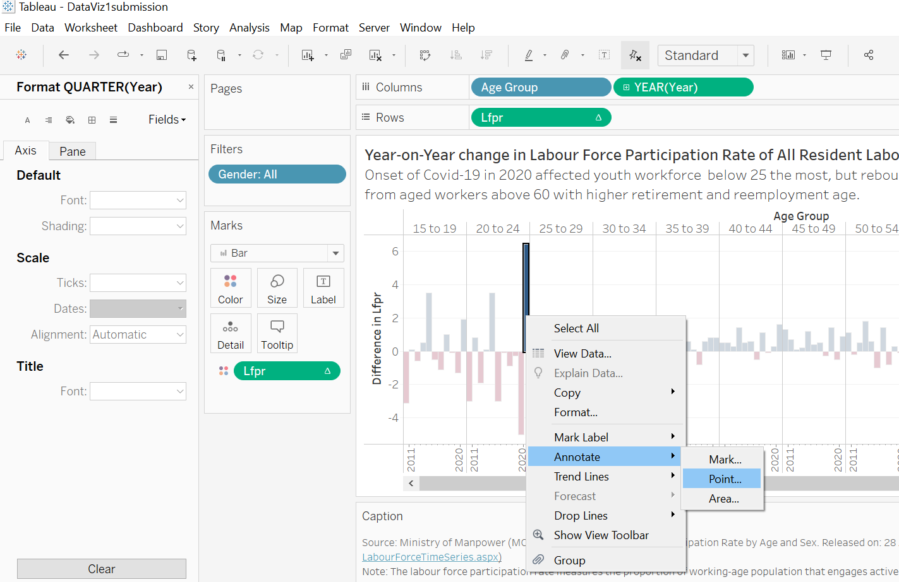

```{r setup, include=FALSE}
knitr::opts_chunk$set(echo = FALSE)
```

```{r}
packages = c('rmarkdown')
for(p in packages){
  if(!require(p,character.only = T)){
    install.packages(p)
  }
  library(p,character.only = T)
}
```
#   1. Original Visualisation 

The original data visualisation below was created using data provided by Ministrty of Manpower, Singapore (MOM). The data are available under the page [Statistical Table: Labour Force](https://stats.mom.gov.sg/Pages/LabourForceTimeSeries.aspx), titled *Resident Labour Force Participation Rate by Age and Sex*. 


There are some issues in terms of clarity and aesthetics of the original data visualization as explained in the subsequent section.  

##  1.1 Clarity

a. **X-axis not properly labelled:** Only the year "2015" was shown and there are no tick marks, hence readers could be misled into thinking that the chart only comprise of 2015's data. However, based on the source, the data actually covers the period 2010 to 2021. 

b. **Y-axis title and scale are unclear:** Although the x-axis was labelled "Lfpr", it coud be unclear to the readers what the acronym is meant to represent. The unit of measurement, which should be "Percentage or %" (as  revealed by the source data) is missing, hence readers might not know what the scale is measuring. A clearer title for the y-axis could be "Labour Force Participation Rate(%)".

c. **Chart Title is not helpful; no lead-in and call-outs:** The title "Labour Force Participation Rate" does not explain the context of the visualisation. Furthermore, there are also no lead-in and call-outs or annotation to explain any trend or insights. Readers would not know the key message that the visualization is trying to convey. We also do not know which country's labour force is depicted in this visualisation with such a vague title. 

d. **Source and definition of data are missing:** The source of data is not included, which would affect the credibility of the visualisation. Without a clear definition of labour force participation rate, readers would not know that the visualisation only show the trend of resident labour force, and it is also not clear if the visualisation comprise of  female, male or both genders. It would be clearer to indicate that the source of the data is from the Singapore Ministry of Manpower, and to provide a definition of how the labour force participation rate is computed.

e. **Arrangement of age categories:** The arrangement of the different age groups in the visualisation is based on the labour force participation rate in ascending order. Hence the different age groups were jumbled, with the older age groups appearing on the left, followed by youngest age group, and the middle-age groups etc. This is confusing to readers who would expect a logical order of the age groups e.g. from youngest to oldest. 

##  1.2 Aesthetics

a. **Redundant legend:** The age group headers are already shown on the chart, hence there is no need for a legend. Furthermore, with so many different colours, it would be hard to use the legend to identify the respective age group.

b. **Repetition of x-axis title:** There is no need to repeat the x-axis title, "Year" for all the age group categories. The repetitive title has no value and over clutter the chart. 

c. **Choice of colour palette:** The use of multi-colour to represent different age group, while fanciful, does not serve any meaning and is distracting.

d. **Distracting grid lines:** The use of multiple grid lines, especially the vertical ones, are distracting and do not serve any meaning as readers will not be able to use the grid lines to gauge the value since there are also no tick marks.  

#   2. Proposed Design

##  2.1 Sketch of the Proposed Design

The sketch of the proposed alternate visualisation to address the clarity and aesthetic issues highlighted in the previous section and to improve the design is shown below:


##  2.2 Advantages of the Proposed Design

### 2.2.1 Clarity

a. **Chart Type**

+ For the first visualisation (Chart 1), a line chart is used to show the time-series data of the labour force participation rate (lfpr) of the different age groups by gender. This would make it easier to visualise the trend of the different gender group across time.

+ For the second visualisation (Chart 2), a bar chart is used to show the change in the lfpr rate of the entire resident labour force compared to the previous year i.e. Yearly change in percentage points. For instance, 2021's figure shows the absolute change in lfpr compared to 2020 (Lfpr of 2021 minus Lfpr of 2020). This will complement Chart 1 to provide a clearer understanding on the fluctuation over the years, as well as years with significant increment or reduction.  

b. **Meaningful Chart Titles**

+ The main title will be "Singapore Resident Labour Force Participation Rate, 2010 - 2021", which will allow readers to immediately understand the context of the visualisation.

+ Each chart will come with their own sub-title and commentary, to provide further clarity on the context, and the key observation(s) of the respective chart.

c. **Clear x-axis, y-axis** 

+ Both axes titles are properly labeled so that readers will know immediately what each chart measure, as well as the age cohort.

+ The scale of the y-axis of Chart 1 starts from 0% to 100%, and that of Chart 2 ranges from a negative % to a postive % which will allow readers to gauge the data easily. 

+ Hide the '70 and over' age group since the data overlaps with two other age groups '70 to 74', '75 and over'.

d. **Provide source and definition**

+ The inclusion of the data source at the bottom of the visualisation will provide clarity and credibility to the visualisation. 

+ The definition of lfpr is also included to provide further elucidation on the data used.

e. **Use of annotations**

+ Annotations are added to highlight to readers the key observations. 

### 2.2.2 Aesthetics

a. **Choice of colour palatte**

+ Use of a single colour scheme for the line chart (Chart 1) that will still be able to differentiate the different gender groups yet do not clutter the data. 

+ Use of diverging colours (red and blue) to differentiate years with positive growth and negative growth (Chart 2). 

+ Simplify the number of grid lines and use of soft colours so that they do not distract. 

b. **Legend**

+ Removal of the redundant legend for the age cohort since the headers already show the respective age cohort.

+ Did away with the need for a legend for the gender grouping by applying the relevant colour in the title of the chart.

c. **Size of the Charts and order of groups**

+ The two charts are aligned so that the it is easier for readers to cross reference both charts with similar axes. 

+ The age cohorts are ordered in ascending order by age, making it easier to read the visualisation.

##  2.3 The Proposed Visualisation

The proposed visualisation can be viewed on Tableau Public [here](https://public.tableau.com/app/profile/bi.lian/viz/DataViz1submission/Dashboard1?publish=yes).


#   3. Step-by-Step Description

No. | Step                 |   Screenshot
--- | ------------------   | ---------------------------
1.  | Download the excel (.xlxs) file from the MOM website (refer to section 1). Load the  excel file into Tableau Prep Builder. Drag the‘mrsd_Res_LFPR_2’ worksheet into main pane.|{width=350px}  
2.  | Select Data Interpreter to clean the data i.e. recognise the correct field labels.|{width=350px}  
3.  | Initiate a clean node, 'Clean 1'. Rename the node description to 'Filter Years'|{width=350px} 
4.  | Select the 'show list view', and remove '1991' to '2009' data by using 'Remove fields'.|{width=350px} 
5.  | Initiate another clean node and rename it 'Create rowID'. Rename 'Age (Years) / Sex' to 'Age Group'. Select 'Create Calculated field'|{width=350px} 
6.  |  Notice that 'Age Group' contains 3 main gender sub-categories, 'Total', 'Male', 'Female', so we need to identify them. Create a new column field, 'ROWID', to identify the groups by using partition and orderby functions.|{width=350px}
7.  |  Create another calculated field to reference the RowID to the respective gender group and name the field as 'Gender'.|{width=350px}
8.  |  Create another clean node by selecting 'Pivot'. Rename the node to 'PivotYears'|{width=350px}
9.  |  Select all the years column fields and drag them to the 'Pivoted field' to convert the column fields to row fields. |{width=350px}
10. |Rename the new pivoted column containing the years to 'Year', and the values to 'LFPR'. |{width=350px}
11. |Exclude the values containing the total lfpr for 'Total', 'Female', 'Male' under the 'Age Group' column field.  |{width=350px}
12. |Create a ‘Output’ node and save output as ‘Dataviz1lfpr’. |{width=350px}
13. |Open Tableau Desktop and load the output file 'Dataviz1lfpr' created in step 12. Hide 'RowID' |{width=350px} 
14. |For Chart 1, create a new worksheet and name it 'MaleFemale’. Drag ‘Age Group’ and ‘Year’ to ‘Columns’ and ‘Lfpr’ to ‘Rows’ shelves. |{width=350px} 
15. |Ensure that the 'Aggregate Measures' under 'Analysis' is uncheck so that tableau does not auto sum up the total lfpr values. |{width=350px} 
16. |Drag 'Gender' to the 'Filters' box and select 'Male' and 'Female'. |{width=350px} 
17. |Drag 'Gender' to the 'Colour' box. Select 'Line' under 'Marks'.  |{width=350px} 
18. | Edit the colour palette of the gender groups by selecting 'Colour' under 'Marks'.  |{width=350px}
19. | Mouse over to 'Year' under 'Tables', click the downward arrow and change Data Type to 'Date'. |{width=350px}
20. | Mouse over to 'Year' under 'columns' shelf, click the downward arrow and select Year. |{width=350px}
21. | Right click on the x-axis and select 'Edit Axis'. Adjust the tick marks according to the screenshot. Ensure that title is removed since year is self-explanatory. |{width=350px}
22. | Format the year axis's colour and font, and change the alignment to 'Up'. |{width=350px}
23. | Right click on the y-axis and select 'Edit Axis'. Adjust the tick marks according to the screenshot. Rename the axis title to 'Labour Force Participation Rate (%)'. Format the axis colour and font similar to step 22. Alignment to retain as 'Normal'.  |{width=350px}
24. | Double click on the chart title to edit the text.  |{width=350px}
25. | Hide the '70 and over' age group. Format the age group headers to be consistent with the x-axis and y-axis. |{width=350px}
26. |For Chart 2, create a new worksheet and name it 'YoYDiff’. Drag ‘Age Group’ and ‘Year’ to ‘Columns’ and ‘Lfpr’ to ‘Rows’ shelves. Repeat Step 15 and 16, but select 'All' under 'Gender' instead, and select 'Bar' under 'Marks'. |{width=350px}
27. |Mouse over to 'Lfpr' under 'Rows' shelf. Select 'Add table calculation', and select ' Pane(down then across). |{width=350px}
28. |Mouse over to 'Lfpr' under 'Data'. Drag 'Lfpr' to 'Color', and add a table calculation similar to step 27. Right click on the 'Difference in lfpr' to format the colours, to ensure that the negative values are red, and postive values are blue. |{width=350px}
29. |Mouse over to '14 Nulls' at the right bottom corner (14 nulls as 2010 do not have any values). Select 'Show data at default position'. |{width=350px}
30. |Repeat step 19 to 21 to format the year axis. Double click on the y-axis to amend the title to 'Yearly Change (% Points)'. Double click the chart title to edit the text. |{width=350px}{width=350px}
31. |Right click at the left bottom blank space of the chart to 'Show Caption'. Double click on the caption to edit, and add the source and definition|{width=350px}
32. |Select the relevant bar/data point and right click to add annotation. |{width=350px}
33. |Format the annotation, and adjust the opacity of the shading. |{width=350px}
34. |Create a new dashboard. Drag the two worksheets to the main frame, and ensure the age groups are aligned. Tweak the size to ensure that the visualisation can be viewed in a page. |{width=350px}
35. |Add a dashboard title |{width=350px}
36. |Select the dashboard tab. Check that the size of the dashboard is correct for viewing on Desktop browser and the dimensions are appropriate. Click 'Publish Workbook' under 'Server'. |{width=350px} 
37.  |Connect to tableau online and sign-in if this is not done earlier. |{width=350px} 
38.  |After sign-in, enter a name for the workbook to be published. Click Save and the workbook is published on Tableau Public. |{width=350px} 

#   4. Key Observations

a.  **Gender difference:** The gap between the lfpr of females and males was not apparent when they are in their youth and young adulthood (below 29), but becomes more apparent when females enter their 30s. However, the gap narrows gradually over the years with more females staying on in the workforce. For instance, in 2010 for the age group 30 to 34, females' lfpr is 81.3%, and males' lfpr is 97.7%. In 2021, the lfpr of females is 90.1%, and that of males is 97%. According to a [written reply to a related Parliament question in 2019 by Minister for Manpower](https://www.mom.gov.sg/newsroom/parliament-questions-and-replies/2019/0211-written-answer-by-mrs-josephine-teo-minister-for-manpower-to-parliamentary-question-on-female-workforce-participation-rate), one of the reasons for the gender difference is likely because women still tend to take on more caregiving roles; and the narrowing gap could be partly attributed to government's and tripartite's initiatives to encourage more female to join the workforce.

b.  **Ageing Workforce:** While the lfpr of workers between 25 to 54 appears to be rather stagnant, the lfpr of those above 55, especially the age cohorts above 60, sees an increase almost every year. The age group 65-69 is the only group which has positive change in percentage point for the last 11 years. The largest increase for this age group occurred in 2011 with an absolute change of about 5 percentage point compared to 2010. 2011 also coincides with the year where MOM announced the introduction of the Retirement and Re-employment Act to provide older workers with the opportunity to work beyond the age of 62, which subsequently took effect in 2012. 

c. **Youth below 24 most volatile, and hardest hit during Circuit Breaker:** The lfpr of youth between 15 to 24 fluctuates the most over the last 12 years compared to the other age cohort. In 2020, the lfpr of those in 20 to 24 age group was 5 percentage point lower compared to the previous year. However, it also quickly rebounded in 2021 with an absolute increase of 6.4 percentage point in 2021. 2020 coincides with the year where Covid-19 pandemic started, with many customer-fronting businesses unable to operate during the Circuit Breaker period from Apr to Jun 2020. Most of the youth of this age group are likely working in such industries, such as F&B, hence they were the hardest hit during this period.

