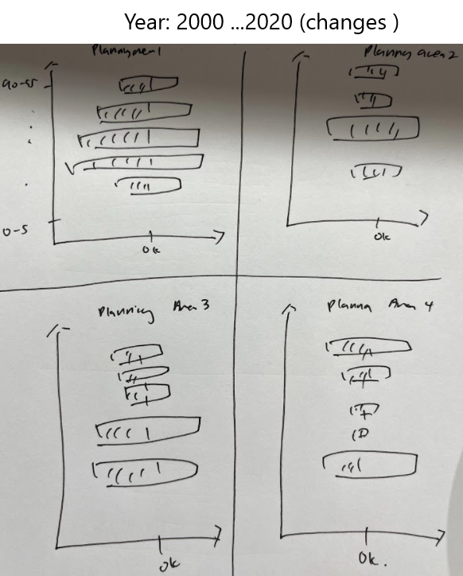

```{r setup, include=FALSE}
knitr::opts_chunk$set(echo = TRUE,
                      eval = TRUE,
                      warning = FALSE,
                      message = FALSE,
                      fig.retina = 3)

```
# 1.0 About the Task

This [take-home exercise](https://isss608-ay2021-22t2.netlify.app/th_ex/th_ex02) requires the application of appropriate interactivity and animation methods to design an age-sex pyramid based data visualisation to show the changes of demographic structure of Singapore by age cohort and gender between 2000-2020 at planning area level.

For this task, the data set used is the Singapore Residents by Planning Area / Subzone, Age Group, Sex and Type of Dwelling, June 2000-2010 and Singapore Residents by Planning Area / Subzone, Age Group, Sex and Type of Dwelling, June 2011-2020 The data set is obtained from [Department of Statistics](https://www.singstat.gov.sg/).


# 2.0 Sketch of Proposed Design

```{r, echo = FALSE, layout = "1-body-outset"}

```

# 3.0  Installing and loading the required libraries

The code chunk below is used to install and load the required packages onto RStudio. 

```{r}
packages = c('gganimate', 'tidyverse', 'gifski', 'plotly')
for(p in packages){
  if(!require(p,character.only = T)){
    install.packages(p)
  }
  library(p,character.only = T)
}
```
# 4.0 Importing the dataset

The source file is in csv format, hence read_csv of  **readr** package is used to import the dataset.

```{r}
Popdata2010 <- read_csv("data/respopagesextod2000to2010.csv")
Popdata2020 <- read_csv("data/respopagesextod2011to2020.csv")
glimpse(Popdata2010)
glimpse(Popdata2020)
```

# 5.0 Data Wrangling

## 5.1 Joining the two datasets

After confirming that the 2 datasets, Popdata2010 and Popdata2020, contain the same variables, rbind function in **Base R** is used to combine both datasets into 1 dataset. 

```{r}
PopdataAll <- rbind(Popdata2010,Popdata2020)
glimpse(Popdata2010)
```

## 5.2 Data Transformation

###  Transforming data of one gender

Drawing reference from [Take-home Ex01](https://bilian-mitb2021.netlify.app/th_ex/th_ex01/take-home_ex01#data-wrangling-1),  Pop values of Males are  transformed to negative values, and binded with the Female dataset using the following code chunk:

```{r}
PopdataAll_M <- PopdataAll %>%
                  filter(`Sex` ==  "Males") %>%
                  mutate (Pop = -Pop)
#
PopdataAll_F <- PopdataAll %>%
                  filter(`Sex` ==  "Females") 

PopdataAll_MF <- rbind(PopdataAll_M,PopdataAll_F)
glimpse(PopdataAll_MF)
```

### Correcting data type of the grouping variables

The following code chunk uses factor() and as.integer() from **Base R**  to convert the variables AG and PG to factors, and Time as integers. This step is required for the data groups to be ordered correctly in the chart (e.g. for Time, when using {frame_time} function, it will become a continuous variable with decimal values if not converted to integers).

```{r}
PopdataAll_MF$AG <- factor (PopdataAll_MF$AG, levels = unique(PopdataAll_MF$AG)) 
PopdataAll_MF$PA <- factor (PopdataAll_MF$PA, levels = unique(PopdataAll_MF$PA)) 
PopdataAll_MF$Time <-as.integer(PopdataAll_MF$Time)

```


### Deriving the frequency count by Planning Area, Time, Age Group and Sex

Next we compute the frequency count of the total population by planning area, time, age group and sex. In the code chunk below, group_by() of **dplyr** package is used to group the data by PA, Time, AG and Sex, and summarise() from the same package is used to count the number of residents.

```{r}
PopdataAll_Grp <- PopdataAll_MF %>%
                    group_by(`PA`, `Time`, `AG`, `Sex`) %>%
                    summarise('Count'= sum(`Pop`)) %>%
                    ungroup()

head(PopdataAll_Grp)
```

# 6.0 Plotting the chart

## 6.1 Population Pyramid by Planning Area (2000 to 2020)

As the requirement is to plot the pyramid by planning area, 4 planning areas (out of a total of 57 planning areas)  are randomly selected using subset() of **Base R**.

```{r}
print(unique(PopdataAll_Grp$PA))
```

To plot the static chart, drawing reference from [Take-home Ex01](https://bilian-mitb2021.netlify.app/th_ex/th_ex01/take-home_ex01#creating-the-population-pyramid), the relevant codes from **ggplot2** package are used. 

```{r}
xbrks <- seq(-300000, 300000, 5000)
xlabls <- paste0(as.character(c(seq(300, 0, -5), seq(5, 300, 5))))

p <- ggplot(subset(PopdataAll_Grp, PA %in% c("Ang Mo Kio", "Sengkang", "Tampines", "Jurong East")), 
      aes (x = AG, y = Count, fill = Sex)) +
      geom_bar(stat = "identity", width = .6 ) +
      scale_y_continuous(breaks = xbrks, labels = xlabls, name = "Population Size ('000)") +
      xlab("Age Groups") +
      coord_flip() +
      theme_bw() 

```

Using facet_wrap of **ggplot2**, we are able to plot the population pyramids of the 4 different planning areas into a 2 by 2 panel. ggplotly() is then used to convert to an interactive plot. 

``` {r}
xbrks1 <- seq(-300000, 300000, 50000)
xlabls1 <- paste0(as.character(c(seq(300, 0, -50), seq(50, 300, 50))))
p1 <- p +  facet_wrap (~ PA, nrow = 2, ncol = 2) + 
            xlab("Age Groups") +
            scale_y_continuous(breaks = xbrks1, labels = xlabls1, name = "Population Size ('000)")

ggplotly(p1)

```

While this plot using ggplotly allows interactivity, such as viewing the data for any selected data point, it does not show the changes in data over the years. 

## 6.2 Displaying changes in population demographic from 2000 to 2020 by Planning Area

To show changes in the demographic over the years by respective planning area, functions from **gganimate** package is used:

* transition_time(): shows the changes in data over the variable Time (i.e. Year of the data).
* {frame_time}: used together with labs() of **ggplot2** to reflect the change in Time (year) in the title when the data changes from year to year.
* enter_fade() and exit_fade(): defines how new data enter and exit. fade is chosen. 
* ease_aes(): defines how a value change to another during tweening. cubic-in-out is chosen.

```{r}
p2 <- p + 
      facet_wrap (~ PA, nrow = 2, ncol = 2) +
      transition_time(Time) +
      labs(title = 'Singapore Age-Sex Population Pyramid 2000-2020 \n\nYear: {frame_time}') +
      enter_fade() +
      exit_fade() +
      ease_aes('cubic-in-out')

p2
```

## 6.3 Final Visualisation after formatting

Finally, animate() of **gganimate** is used to render the the chart object and finetune the animation. 24 frame per second over a duration of 20 seconds is chosen for smoother motion. The size of the object is also adjusted to 750 x 600 for better visualisation.

```{r}
animate (p2, fps = 24, duration = 20, 
         width = 750,
         height = 600
        )

```

From the visualisation, we can easily see that across most of the planning areas, with the exception of Sengkang, Singapore's birth rate is slowing down over the years, and the population is ageing. For Sengkang, it is one of the newer estates which sees an increasing population of younger families over the years. 

As the R codes are reproducible, we can easily add in other planning areas for comparison depending on the areas of interest. 

# Challenges and future work

The main challenge with this take-home exercise is the amount of time given and having sufficient experience in using the correct R packages. With suitable R packages and functions, more layers can be added to the chart object depending on user needs. For instance, using **crosstalk** package, we can  have  a drop down list to allow users to select the planning area, and a slider for users who prefer to manually filter the planning area and year. 

# References

* https://towardsdatascience.com/population-pyramid-animation-cfa7c1a79a63
* https://ggplot2-book.org/facet.html
* https://www.datanovia.com/en/blog/how-to-subset-a-dataset-when-plotting-with-ggplot2/
* https://www.datanovia.com/en/blog/gganimate-how-to-create-plots-with-beautiful-animation-in-r/
* https://gganimate.com/


[Back to homepage](https://bilian-mitb2021.netlify.app/)

